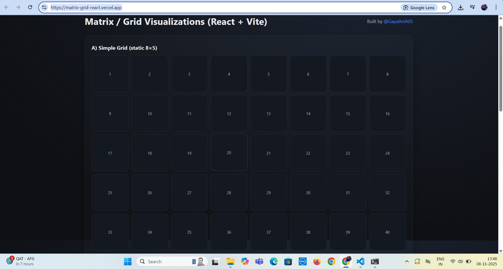

# Matrix / Grid Visualizations (React + Vite)

[](https://matrix-grid-react.vercel.app/)

A simple yet practical project demonstrating **static and interactive matrix/grid layouts** built using **React + Vite** with pure CSS Grid.  
This project showcases how to build a dynamic, clickable grid with multi-select functionality and a Reset option.

---

## 📸 Preview

> Screenshot of the Interactive Grid section

<p align="center">
  
</p>

---

## 📍 Why I Built This Project

I created this project to strengthen my understanding of:

- CSS Grid layout system  
- State management in React  
- Handling multi-dimensional data structures in UI  
- Deploying React projects with Vite  

This also serves as a clean reference for anyone learning how to build grid-based interactive UI components.

---

## ✨ Features

✅ **Simple Static Grid** – Built using pure CSS Grid  
✅ **Interactive Matrix Grid** – Click to select/deselect cells  
✅ **Multi-select Support**  
✅ **Reset Button** to clear selections  
✅ Displays **count of selected cells**  
✅ Fully responsive and beginner-friendly code  

---

## 🧠 Tech Stack

- **React 18**
- **Vite**
- **JavaScript (ES6+)**
- **CSS Grid**
- **Vercel** for deployment

---

## 🚀 Run Locally

Clone the project:

```bash
git clone https://github.com/GayathriA05/matrix-grid-react.git
